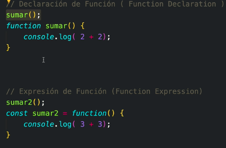
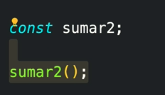

# Funciones

Son intrucciones

## Function declaration and Function expression

Diferencias
- Sólo la primera se ejecuta por el hoisting




- Etapa de lectura y etapa de ejecución, se traduce en




### Diferencia entre funciones y métodos

### Parámetros y Argumentos

```js
function sumar(a,b){ // a y b son parámetros
  console.log(a+b) // 7
}

sumar(2,5) // a y 5 son argumentos, es decir, los valores reales

```
### Parámetros por default

```js 
function sumar(a,b=3){ 
  console.log(a+b) // 5 
}
sumar(2) 

```
### Añadir funciones a un Objetos

Un método de propiedad es una función que es el value de un key (propiedad) dentro de un objeto

```js
const reproductor = {
  cancion: '',
  reproducir: id => console.log(`reprodunciendo ${id}`),
  pausar: () => console.log(`pausando... `),
  borrar: id => console.log(`borranndo ${id}`),

  // set agrega valores
  set nuevaCanción(cancion){
    this.cancion = cancion:
    console.log(`Añadiedo ${cancion}`)
  },

  // get obtiene valores
  get obtenerCanción(cancion){
    console.log(`Escuchando ${cancion}`)
  }
}

reproductor.reproducir(30);
reproductor.pausar();
reproductor.borrar(30);

reproductor.nuevaCancion = 'TKN';
reproductor.obtenerCancion;

```

### Arrow Functions 

- Eliminar llaves
- return implicito
- sin paréntesis en 1 parámetro
