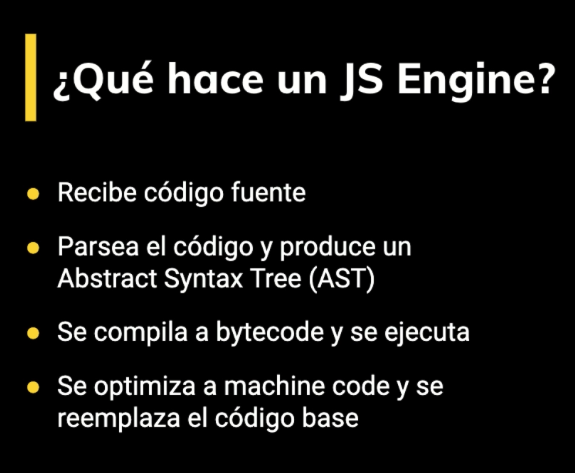
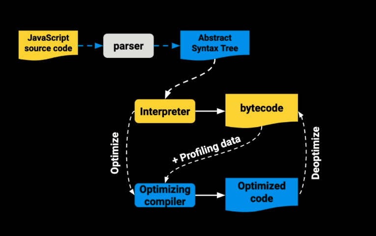
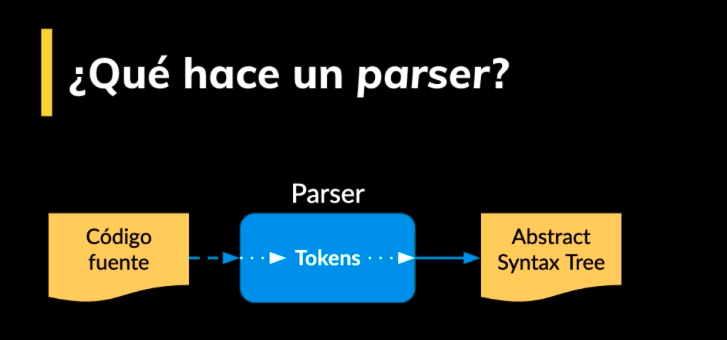
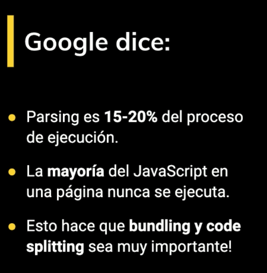
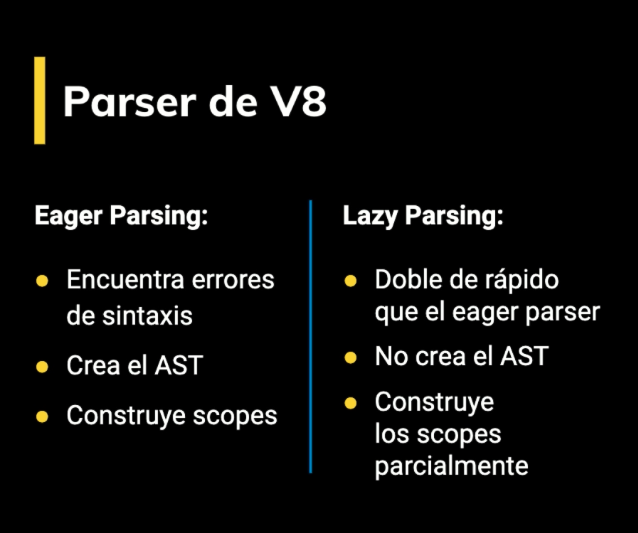
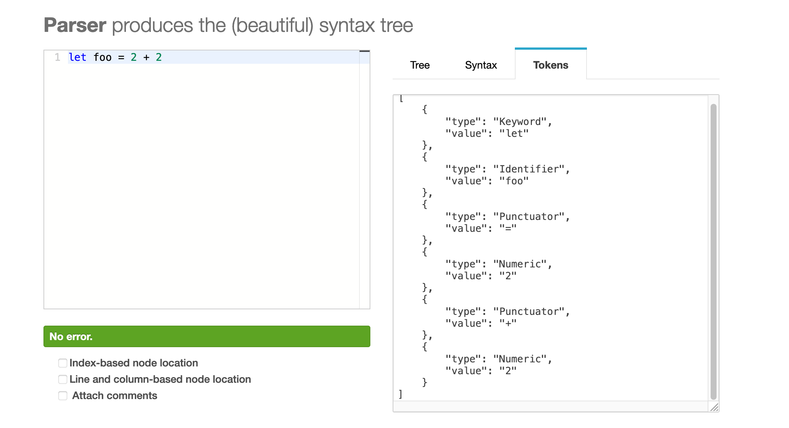
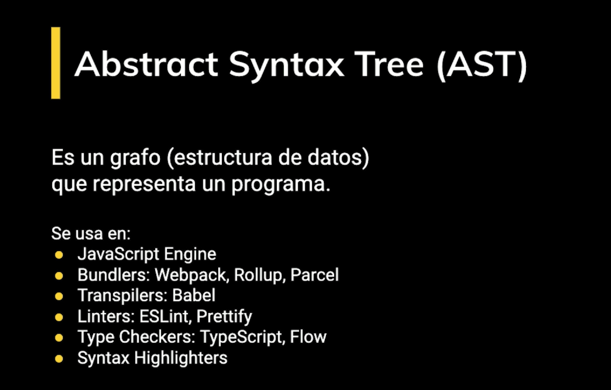
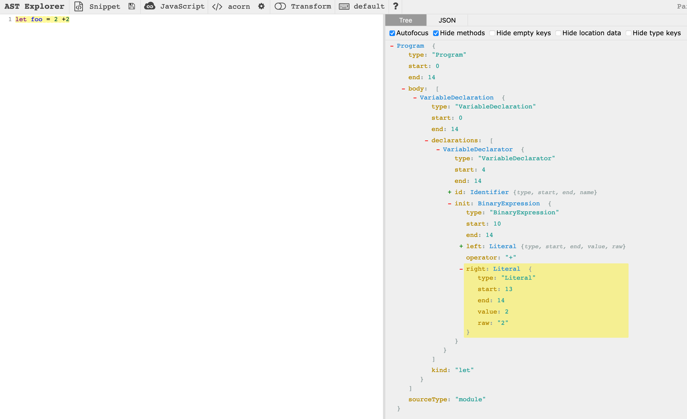

# Cómo funciona JavaScript

Los *tokes* son la descomposción del código fuente, el parser analiza el código y muestra los errores (SyntaxError) cuando el motor de JS se encuentra con partes de código que no forman parte de la sintaxis del lenguaje al naalizar el código

Se debe hacer una empaquetación adecuada del código

Dos formas de hacer parsing:

**TOKENS**

[tokens](https://esprima.org/demo/parse.html#)

**AST**

[ast](https://astexplorer.net/)

**AST Explorer**

Se puede crear nuestras propias reglas por ejemplo

[ast](https://astexplorer.net/#/gist/16fc27fc420f705455f2b42b6c804aa1/d9cc7988c2c743d7edfbb3c3b1abed866c975ee4)

**Byecode**

