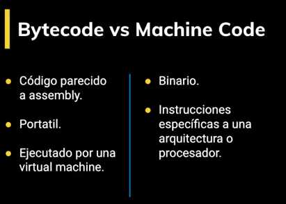
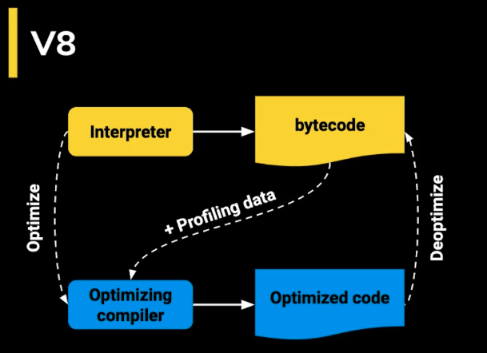
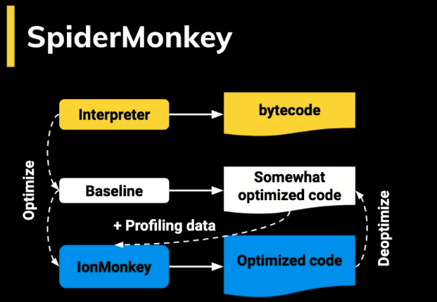
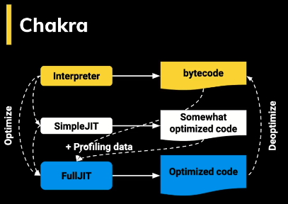
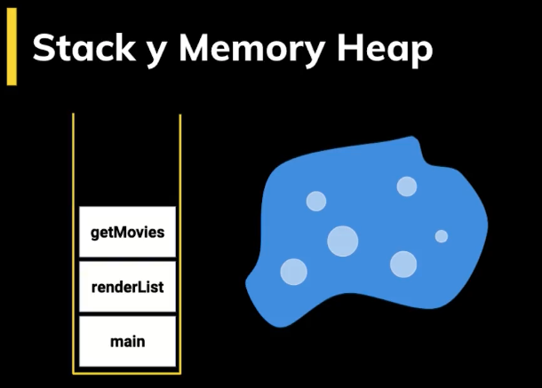
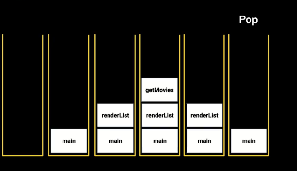
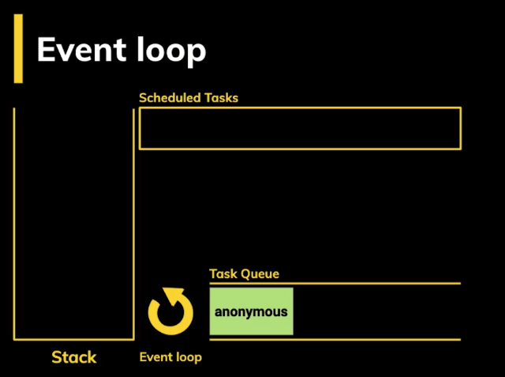
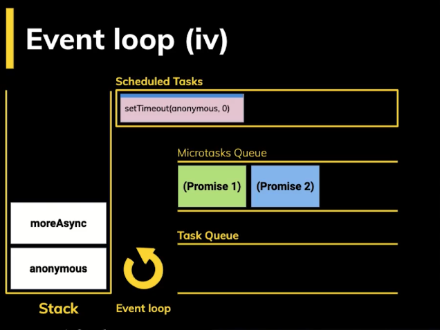

# Cómo funciona JavaScript

Los *tokes* son la descomposción del código fuente, el parser analiza el código y muestra los errores (SyntaxError) cuando el motor de JS se encuentra con partes de código que no forman parte de la sintaxis del lenguaje al naalizar el código

Se debe hacer una empaquetación adecuada del código

Dos formas de hacer parsing:

**TOKENS**

[tokens](https://esprima.org/demo/parse.html#)

**AST**

[ast](https://astexplorer.net/)

**AST Explorer**

Se puede crear nuestras propias reglas por ejemplo

[ast](https://astexplorer.net/#/gist/16fc27fc420f705455f2b42b6c804aa1/d9cc7988c2c743d7edfbb3c3b1abed866c975ee4)

**Byecode**

Google ocupa v8 

Firefox ocupa SpiderMonkey

Edge chackra

Safari JavaScriptCore

## EVENTLOOP

Hace que JS parezca multihilo pero JS es singlethread

ejemplo multithread:

- C=
- Cilk
- Cilk Plus
- Cind
- C#
- Clojure
- Concurrent Pascal
- Emerald
- Fork – programming language for the PRAM model.
- Go
- Java1​
- ParaSail
- Rust2​
- SequenceL

JavaScript se organiza usando dos tipos de datos: Stack y MemoryHeap

Stack: Es el registro delas funcionesHay un orden, el stack comienza vacio, al hacer una operacion push vamos poniendo las funciones unas sobre otras dentro del contenedor. pop saca las funciones de la ultima a la primera para vaciar el stack. Lo primero que entra es lo ultimo que sale

Registra el scope de cada cosa

MemoryHeap: Escrutcuta deorganizada, guarda info sobre las variables, elscope etc

TASK QUEU lo primero qu eentra lo primero que sale

Las PROMESAS funcionan diferente, el eventloop le da preferencia a las microtareas

Es importante no hacer tareas bloqueantes