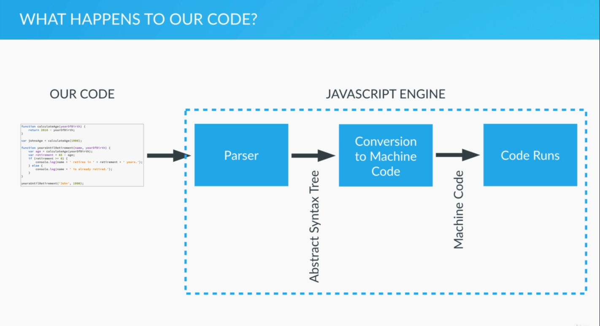
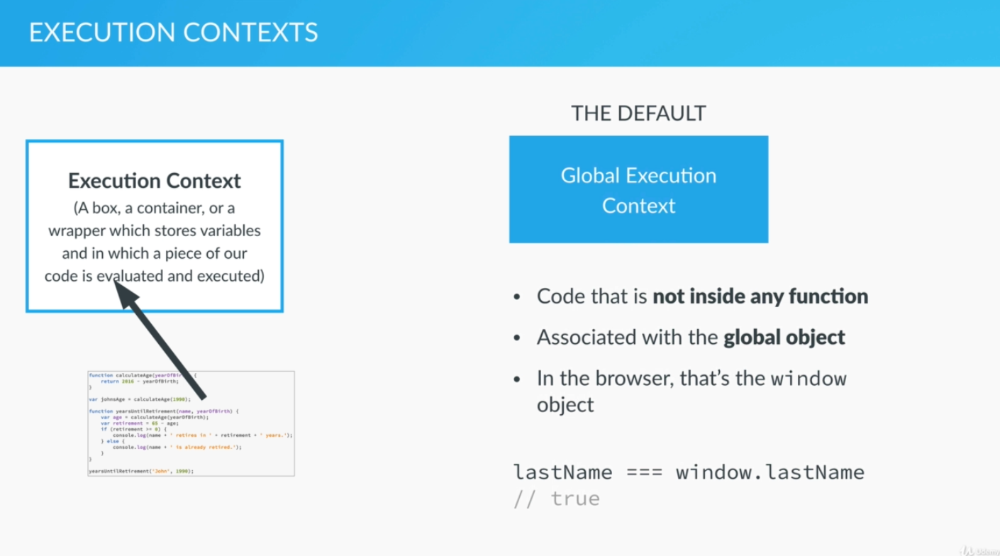

# Behind the scenes

**How the code is executed**

This image belongs to  [The Complete Javascript Course 2020](https://www.udemy.com/share/101WfeBksSdFlTQHQ=/) by **Jonas Shmedtmann**

**Execution contexts and the execution stack**

This image belongs to  [The Complete Javascript Course 2020](https://www.udemy.com/share/101WfeBksSdFlTQHQ=/) by **Jonas Shmedtmann**