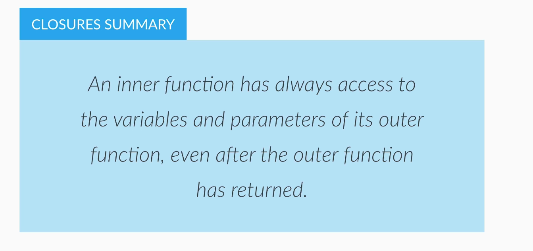
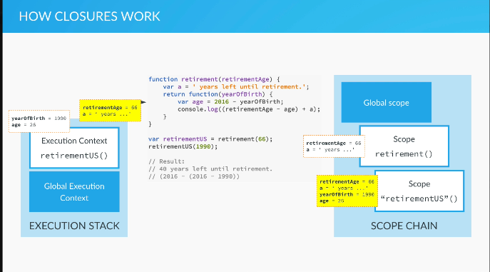

# FIRST CLASS FUNCTIONS

Functions in JS are always **first class functions**


*This image belongs to  [The Complete Javascript Course 2020](https://www.udemy.com/share/101WfeBksSdFlTQHQ=/) by **Jonas Shmedtmann***

## PASSING FUNCTIONS AS ARGUMENTS 


In the example below it is possible to see how to do modular and more readble code

e.g. We have an array of ages and we want to execute different functions using the different numbers in the array. In order to do so we can make a function pattern that fits to each function 

```js
var years = [1990, 1965, 1937, 2005, 1998];
```

```js
// The function accepts two arguments: the arr and a function (callback function)
function arrayCalc(arr, fn) {
    // Creates a new array that stores the result of the callback function
    var arrRes = [];
    // A loop that iterates over the passed array
    for (var i = 0; i < arr.length; i++) {
      // 1. On each iteration the function is called fn() 
      // 2. fn() receives the iteration as a param arr[i]
      // 3. The result of the functions is pushed into the above array arrRes.push()
        arrRes.push(fn(arr[i]));
    }
    return arrRes;
}

```
```js
function calculateAge(el) {
  return 2020- el;
}
```
```js
function isFullAge(el) {
  return el >= 18;
}
```
```js
function maxHeartRate(el) {
  if (el >= 18 && el <= 81) {
      return Math.round(206.9 - (0.67 * el));
  } else {
      return 'age not between the numbers';
  }
}
```
```js
var ages = arrayCalc(years, calculateAge);
var fullAges = arrayCalc(ages, isFullAge);
var rates = arrayCalc(ages, maxHeartRate);
```
```js
console.log(ages);     // [ 30, 55, 83, 15, 22 ]
console.log(fullAges); // [ true, true, true, false, true ]
console.log(rates);    // [ 187, 170, "age not between the numbers", "age not between the numbers", 192 ]
script.js:36:9
```

## FUNCTIONS RETURNING FUNCTIONS

```js
function interviewQuestion(job) {
  if (job === 'designer') {
    //anonymous function
    return function(name) {
        console.log(name + ', can you please explain what UX design is?');
    }
  } else if (job === 'teacher') {
    return function(name) {
        console.log('What subject do you teach, ' + name + '?');
    }
  } else {
    return function(name) {
        console.log('Hello ' + name + ', what do you do?');
    }
  }
}
```
This var stores the anonymous functions that matched with 'teacher'
```js
var teacherQuestion = interviewQuestion('teacher');
                    ===
var teacherQuestion = function(name) {
  console.log('What subject do you teach, ' + name + '?');
} 
```
This var stores the anonymous functions that matched with 'teacher'
```js
var designerQuestion = interviewQuestion('designer');
```

Now we are calling the anonymous function
```js
teacherQuestion('John');
designerQuestion('John');
designerQuestion('Jane');
designerQuestion('Mark');
designerQuestion('Mike');
```

This works because it is read from right to left, first resolve the first function with the first arugument and then resolve the return function with the second argument
```js
interviewQuestion('teacher')('Mark');
```

## IMMEDIATLY INVOKED FUNCTION EXPRESSIONS IIFE

A function declaration being called immediatly 
```js
function game() {
  var score = Math.random() * 10;
  console.log(score >= 5);
}
game();
```

**IFFE**

Here we are creating a new scope for variables, data privacy,  do not interfere with other variables
```js
(function () {
  var score = Math.random() * 10;
  console.log(score >= 5);
})();

//It is impossible to see the score value beacuse it it inside de IIFE
console.log(score);
```
We can pass arguments to IIFE
```js
(function (goodLuck) {
  var score = Math.random() * 10;
  console.log(score >= 5 - goodLuck);
})(5);
```

## CLOSURES



*This image belongs to  [The Complete Javascript Course 2020](https://www.udemy.com/share/101WfeBksSdFlTQHQ=/) by **Jonas Shmedtmann***

```js
function retirement(retirementAge) {
  var a = ' years left until retirement.';
  return function(yearOfBirth) {
      var age = 2020 - yearOfBirth;
      console.log((retirementAge - age) + a);
  }
}
```
In this variable we are storing the inner function, that is the return, of the retirement()
```js
var retirementUS = retirement(66);
```

resulting ⬇️ 

```js
var retirementUS = function(yearOfBirth) {
  var age = 2020 - yearOfBirth;
  console.log((retirementAge - age) + a);
} 
```
 Then we call retirement()
 ```js
var retirementGermany = retirementUS(65);
 ```

By the time we are calling the inner functions retirementUS() the function that created it , retirememnt(), has already finished, has already returned a value, dissapeareed in some sense. 

So we are using the values created/passed on the outer function in the inner function that now is stored in a  variable, we can acces to them. This is closure and has to do with scope chain object

Using closures we can use a single function to different porpuses.

Let's see how we an recreate a function with closure


In this example we are creating a function that contains different return possibilities, each contrain has its own return function.
```js
function interviewQuestion(job) {
  if (job === 'designer') {
    //anonymous function
    return function(name) {
      console.log(name + ', can you please explain what UX design is?');
    }
  } else if (job === 'teacher') {
    return function(name) {
      console.log('What subject do you teach, ' + name + '?');
    }
  } else {
    return function(name) {
      console.log('Hello ' + name + ', what do you do?');
    }
  }
}
```

It is possible to see that we are repeating the same function three times, so we cas use closures to use onse single return funtion and use outer values instead

```js
function interviewQuestion(job) {
  return function(name) {
    if (job === 'designer') {
        console.log(name + ', can you please explain what UX design is?');
    } else if (job === 'teacher') {
        console.log('What subject do you teach, ' + name + '?');
    } else {
        console.log('Hello ' + name + ', what do you do?');
    }
  }
}

interviewQuestion('teacher')('John');

interviewQuestion('designer')('Mark');

interviewQuestion('developer')('Sofia');
```

**How closures work**




*This image belongs to  [The Complete Javascript Course 2020](https://www.udemy.com/share/101WfeBksSdFlTQHQ=/) by **Jonas Shmedtmann***