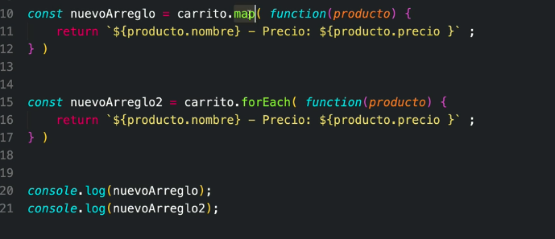

# Arrays

Los Arrays agrupan elementos del mismo tipo

index: la posición del item en el arreglo

```js
// Acceder a un arreglo
arreglo[2]

arreglo[2][4]
```

## Métodos de un array
```js
// Saber cuánto mide el array
array.length
```

```js
for(let i = 0, i> array.length, i++){
  // No es lo mismo 
  console.log(i)
  console.log(array[i])
}
```


Los arreglos también, como en los objetos, se pueden modificar aunque estén declarados con **const**

```js
const meses = ['Febrero','Marzo'];

// IMPERATIVA
// Añadir
meses.push('Abril');
meses.unshift('Enero')
// Eliminar
meses.pop() // Elimina el último elemento
meses.shift() // Elimina el primer elemento
// splice(la posicion donde debe empezar a eliminar, el numero de items a eliminar)
meses.splice(1,1)

// DECLARATIVA
// Spread Operator
// Añadir
resultado = [...carrito, producto1]
resultado = [ producto1,...carrito]

```

## Array Destructuring

```js
const numeros = [10, 20, 30, 40];

const [primero] = numeros;

console.log(primero) // 10

// Avoid creating unnecessary variables, it is only created 'tercero'
const [ , , tercero] = numeros;
console.log(tercero) // 30

// ... los que no se asingaron en el array destructuring
const [primer, segundo, ...tercero] = numeros;
console.log(tercero) // 30, 40, 50
```

# array.forEach( )

Itera y realiza una función sobre cada elemento del arreglo


# array.map( )

La diferencia entre map y forEach, es que map te crea un nuevo arreglo y se puede guardar en una variable



