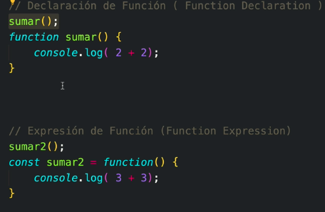
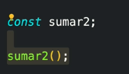

# Funciones

Son intrucciones

## Function declaration and Function expression

Diferencias
- Sólo la primera se ejecuta por el hoisting




- Etapa de lectura y etapa de ejecución, se traduce en




### Diferencia entre funciones y métodos

### Parámetros y Argumentos

```js
function sumar(a,b){ // a y b son parámetros
  console.log(a+b) // 7
}

sumar(2,5) // a y 5 son argumentos, es decir, los valores reales

```
### Parámetros por default

```js
function sumar(a,b=3){ 
  console.log(a+b) // 5 
}
sumar(2) 

```

 