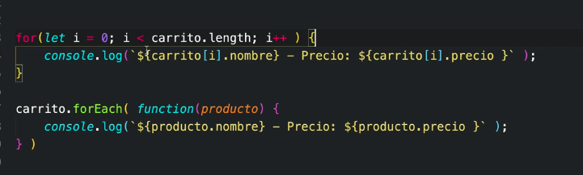

# Iteradores

## For

```js
for(let i = 0, i> array.length, i++){
  // No es lo mismo 
  console.log(i) // va a consolear el valor de i
  console.log(array[i]) // va a obtener el valor de item del array que se encuentra en la posicion i
} 
```

```js
for(let i = 1, i <= 20, i++){
  if( i % 2 === 0) {
    console.log('Es par')
  } else {
    console.log('Es impar')
  }
}
```
**break && continue**

The break statement can be used to jump out of a loop.  

The break statement breaks the loop and continues executing the code after the loop (if any):

The continue statement breaks one iteration (in the loop), if a specified condition occurs, and continues with the next iteration in the loop.

## Fizz Buzz

Del 0 al 100, los múltiplos de 3 deben imprimir Fizz y los de 5 Buzz, y los que son de los dos (3 y 5) imprimen Fizz Buzz

```js
// Lo importante de este ejercicio es observar el orden en el que las condiciones se cumplen para que no se descarten entre sí
s
for(let i = 1, i < 100, i++){
  if(i % 15 === 0){
    console.log('FIZZ BUZZ')
  }else if(i % 3 === 0){
    console.log('FIZZ')
  }else if(i % 5 === 0){
    console.log('BUZZ')
  }
}
```
## WHILE
```js
while(condition){
  do this
}
```
## DO WHILE

Se ejecuta al menos una vez y después verifica la condición

```js
do{
  do this 
} while (condition)
```

## FOR EACH

array.forEach( )

Itera y realiza una función sobre cada elemento del arreglo




##  MAP

array.map( )

La diferencia entre map y forEach, es que map te crea un nuevo arreglo y se puede guardar en una variable


```js
// map
console.log(nuevoArreglo)  // va a ser un array []

// forEach
console.log(nuevoArreglo2) // undefined
```
## FOR ...OF
**Itera sobre arrays**
```js
const pendientes = ['tarea','correr','estudiar'];

const carrito = [
  { nombre: 'telefono', precio: 200 },
  { nombre: 'monitor', precio: 400 },
  { nombre: 'teclado', precio: 500 }
]
for(let pendiente of pendientes){
  console.log(pendiente)  // tarea
                          // correr
                          // estudiar
}

for(let producto of carrito){
  console.log(producto)   // { nombre: 'telefono', precio: 200 }
                          // { nombre: 'monitor', precio: 400 }
                          // { nombre: 'teclado', precio: 500 }
}


```
## FOR ...IN
**Itera sobre objetos**

```js
// ARRAY, nos muetra el index no el item
const pendientes = ['tarea','correr','estudiar'];

for(let pendiente in pendientes){
  console.log(pendiente)  // 0
                          // 1
                          // 2
}

// Sobre un objeto nos da las keys
const automovil = {
  modelo: 'Camaro',
  year: 1969,
  motor: '6.0'
}

for(let spec in automovil){
  console.log(spec) // modelo
                    // year
                    // motor
}

// Pero es posible obtener los values
for(let spec in automovil){
  console.log(`${automovil[spec]}`) // 'Camaro'
                                    // 1969
                                    // '6.0'
}

// ES7 También se puede hacer así:
for(let [key, value] of Object.entries(automovil)){
  console.log(value)  // 'Camaro'
                      // 1969
                      // '6.0'
  console.log(key)                    
}

```

