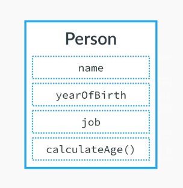
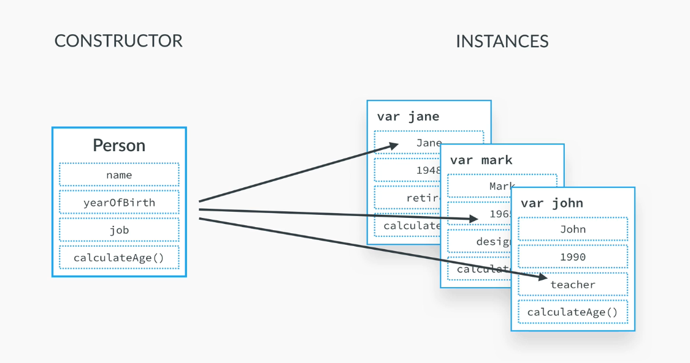
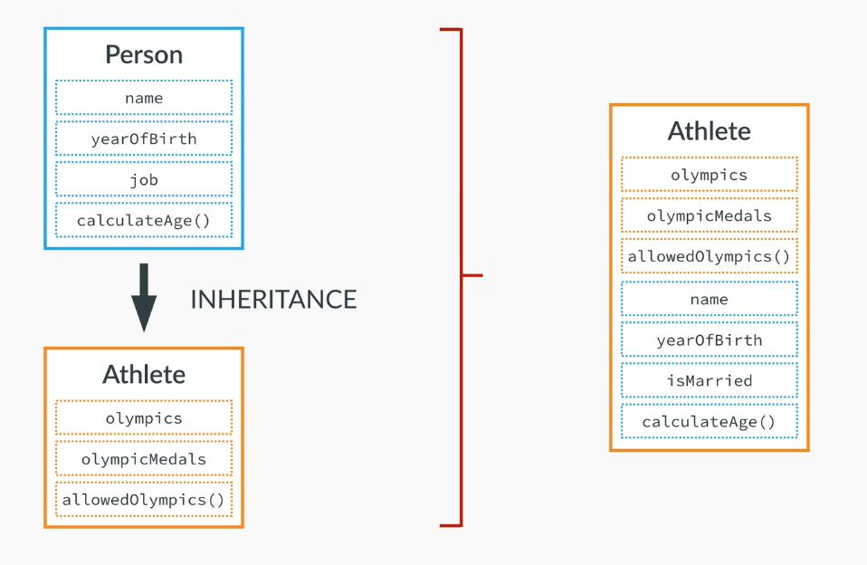
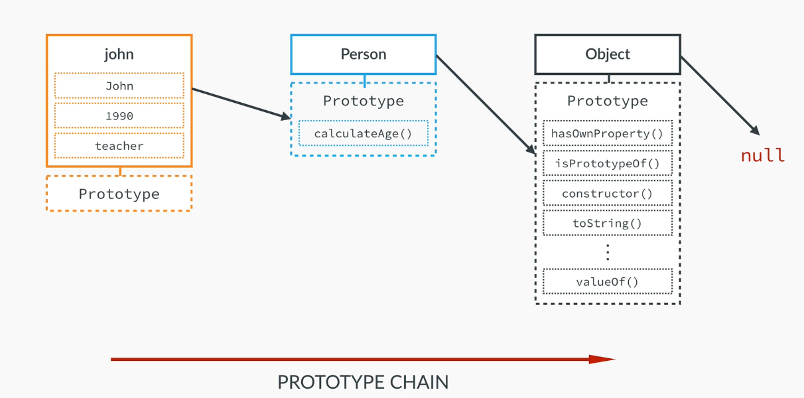
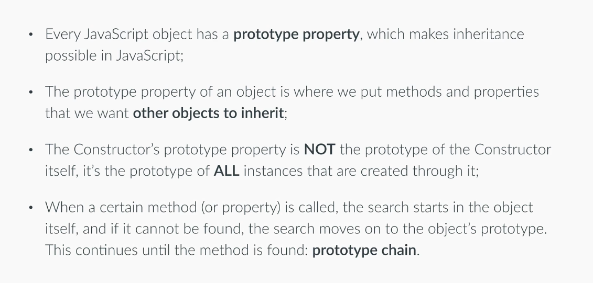

# OBJECTS

1. Primitives
- Numbers
- Strings
- Booleans
- Undefined
- Null

2. Everything else...is an object
- Arrays
- Functions
- Objects
- Dates
- Wrappers for Numbers, Strings, Booleans

## OOP

A blueprint, called a class however in JS it is called **contructor** or **prototype**.



*This image belongs to  [The Complete Javascript Course 2020](https://www.udemy.com/share/101WfeBksSdFlTQHQ=/) by **Jonas Shmedtmann***


So we use a **constructor** to create **instances**



*This image belongs to  [The Complete Javascript Course 2020](https://www.udemy.com/share/101WfeBksSdFlTQHQ=/) by **Jonas Shmedtmann***

## Inheritance
One object is based on another object, have access to another's objects properties and methods.



*This image belongs to  [The Complete Javascript Course 2020](https://www.udemy.com/share/101WfeBksSdFlTQHQ=/) by **Jonas Shmedtmann***

JavaScript is a protype based language

Each JS object has a prototype property which allows inheritance.

**Protype Object**


*This image belongs to  [The Complete Javascript Course 2020](https://www.udemy.com/share/101WfeBksSdFlTQHQ=/) by **Jonas Shmedtmann***



*This image belongs to  [The Complete Javascript Course 2020](https://www.udemy.com/share/101WfeBksSdFlTQHQ=/) by **Jonas Shmedtmann***


## Function constructor

This is an **OBJECT LITERAL**
```js
var john = {
  name: 'John',
  yearOfBirth: 1990,
  job: 'teacher'
};
```

1. **FUNCTION CONSTRUCTOR** is a pattern

Person is the name of the constructor

The parameters are the properties we want to have in our constructor
```js
var Person = function(name, yearOfBirth, job) {
  // this.name is the name we want the parameter to have = name that is the parameter we are passing to the function
  this.name = name;
  this.yearOfBirth = yearOfBirth;
  this.job = job;
}
```

**ADD A METHOD** to the object

```js
/*var Person = function(name, yearOfBirth, job) {
  // this.name is the name we want the parameter to have = name that is the parameter we are passing to the function
  this.name = name;
  this.yearOfBirth = yearOfBirth;
  this.job = job;
  this.calculateAge = function(){
    console.log(2020 - this.yearOfBirth);
  }
}*/
```

In order to make our more eficient we will use INHERITANCE to create methods and attaching methods to the prototype

The method is not anymore in the consturcture but we ca use it because it is in the prototype
```js
Person.prototype.calculateAge  = function() {
  console.log(2020 - this.yearOfBirth);
};
```
It is unlikely to make a property like below but it is possible
```js
Person.prototype.lastName = 'Smith';
```
2. **INSTANCIATION** Create the object/instance

NEW = creates an empty object and then the function is called Person() , a new execution context with this variable

In a regular function this called the global object so the new operator points this to the new empty object
```js
var john = new Person('John', 1990, 'teacher');
var jane = new Person('Jane', 1969, 'designer');
var mark = new Person('Mark', 1948, 'retired');
```

```js
john.calculateAge(); // 30
jane.calculateAge(); // 51
mark.calculateAge(); // 72
```

## Using the browser console

> jonh instanceOf Person

< true

> var x = [2, 4, 6]
> console.info(x)
< We access to the prototype property of the object

## Another way to create objects

**Object.create**

It is not a constuctor, just a variable object
```js
var personProto = {
  calculateAge: function() {
      console.log(2016 - this.yearOfBirth);
  }
};
```

Create jonh

We pass the object we defined to be the prototype object to the method create()

```js
var john = Object.create(personProto);
```
Then we fill the object with the data, however this is not the ideal
```js
john.name = 'John';
john.yearOfBirth = 1990;
john.job = 'teacher';
```

Object.create accepts two arguments, the second accepts the data
```js
var jane = Object.create(personProto, {
  name: { value: 'Jane' },
  yearOfBirth: { value: 1969 },
  job: { value: 'designer' }
});
```

## Primitives vs Objects

A variable containing a primitive stores the primitive itself unlike those variables containing objects that contain a reference to the memory where the object is stored, that is , the variable points to it 

**Primitives**
```js
var a = 23;
var b = a;
a = 46;
console.log(a); // 46
console.log(b); // 23

// b did not change the value when a changed below
```

**Objects**
```js
var obj1 = {
  name: 'John',
  age: 26
};

var obj2 = obj1;
obj1.age = 30;
console.log(obj1.age); // 30
console.log(obj2.age); // 30 here we would expect 26

// we did not create a new object2, No copy was created, both hold a reference that points to the same object in the memory

```
**Functions**

Functions work the same as objects
```js
var age = 27;
var obj = {
    name: 'Jonas',
    city: 'Lisbon'
};

function change(a, b) {
    a = 30;
    b.city = 'San Francisco';
}

change(age, obj);
console.log(age);      // 27 
console.log(obj.city); // San Francisco 
// San Francisco because we are pointing to the same object in memory


```