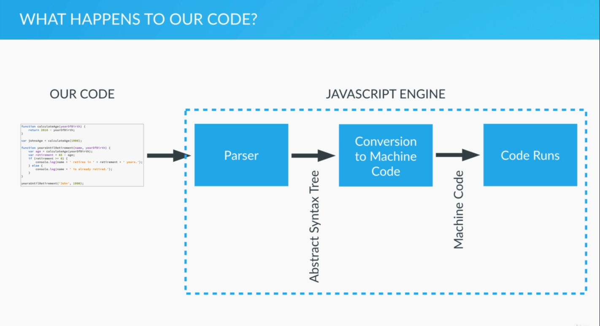
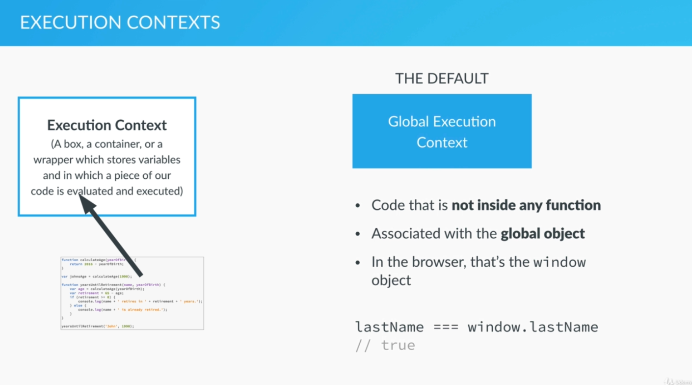
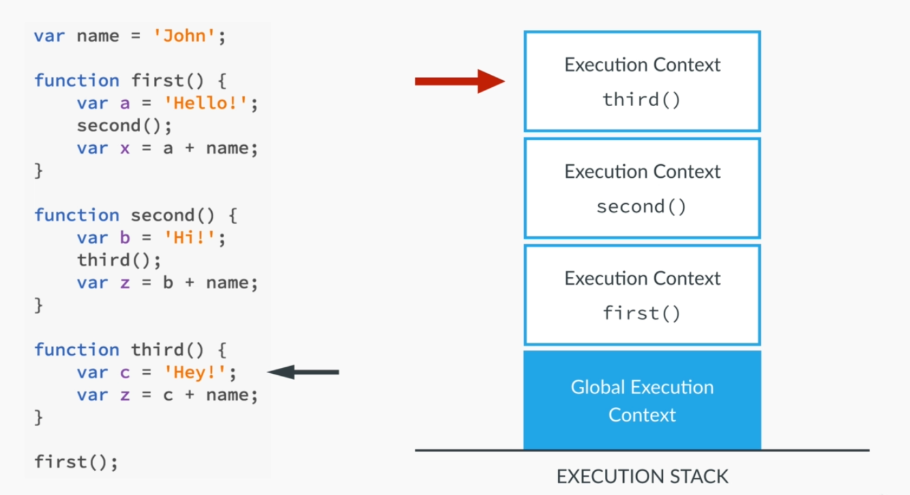
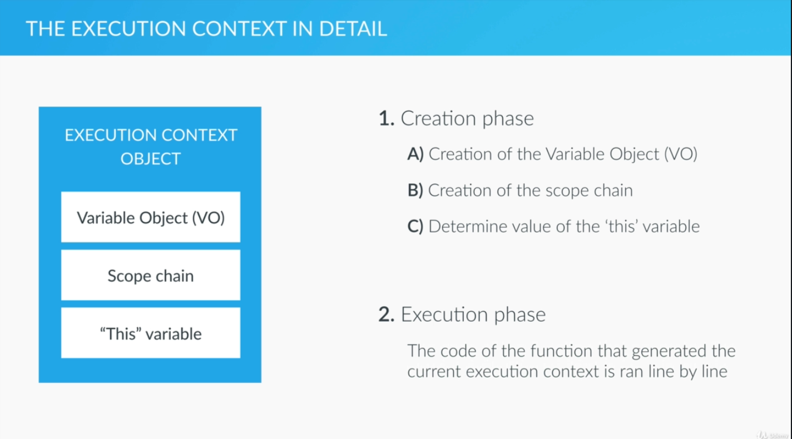
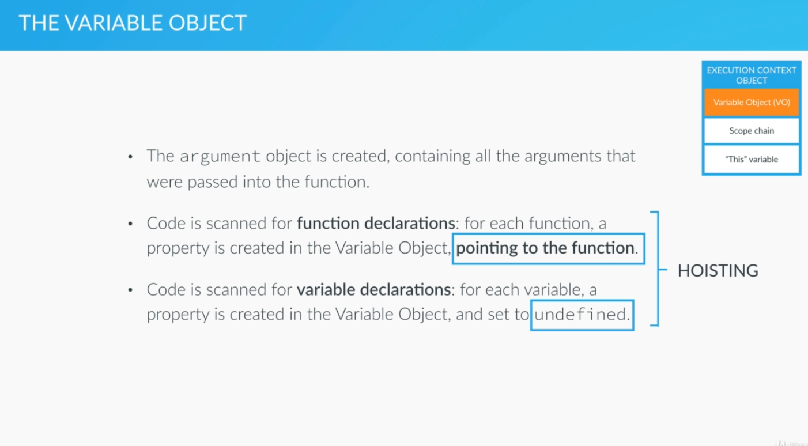

# Behind the scenes

**How the code is executed**

This image belongs to  [The Complete Javascript Course 2020](https://www.udemy.com/share/101WfeBksSdFlTQHQ=/) by **Jonas Shmedtmann**

**Execution contexts and the execution stack**

The order in which the code is run 

This image belongs to  [The Complete Javascript Course 2020](https://www.udemy.com/share/101WfeBksSdFlTQHQ=/) by **Jonas Shmedtmann**

- Execution context is an evironment where js code runs

- Everything that is declare on the global context gets attached to the window object

- When an executed context is created?

- Execute functions, create execution contexts and removing them from the stack when the functions return

This image belongs to  [The Complete Javascript Course 2020](https://www.udemy.com/share/101WfeBksSdFlTQHQ=/) by **Jonas Shmedtmann**

**How an execution context is created**

- We can associate an execution context with an object (e.g. window), this object has three properties:
    - Variable Object VO: which will contain function arguments and function declarations.
    - Scope chain: the current variable object as well as the VO of its parents
    - 'this' variable

This image belongs to  [The Complete Javascript Course 2020](https://www.udemy.com/share/101WfeBksSdFlTQHQ=/) by **Jonas Shmedtmann**

  Hoisting : Functions and variables are available before the execution phase actually starts, however they are different functions are already defined before the execution while variables are set up as undefined and they are defined when the code is executed

This image belongs to  [The Complete Javascript Course 2020](https://www.udemy.com/share/101WfeBksSdFlTQHQ=/) by **Jonas Shmedtmann**