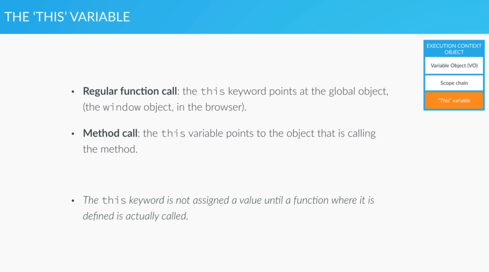

# 'THIS' variable

It is the variable that each execution context gets.
It gets a value until the a funtion is caled because of hoisting fenomena


This image belongs to  [The Complete Javascript Course 2020](https://www.udemy.com/share/101WfeBksSdFlTQHQ=/) by **Jonas Shmedtmann**

```js 
console.log(this); // the window object, the default object
```
Function declaration always point to window object because 'this' is not called in a method
```js
calculateAge(1985);

function calculateAge(year) {
    console.log(2016 - year);
    console.log('this',this); // the window object, the default object
} 
```
Here this is assigned a value becuse is within a method
```js

var john = {
  name: 'John',
  yearOfBirth: 1990,
  calculateAge: function() {
      console.log(this); // the jonh object beacuse refers to the object that call the method
      console.log(2020 - this.yearOfBirth); // 1990

      function innerFunction() {
        console.log('inner',this); // the window object, the default object because is a regular function not a method
      }
      innerFunction(); 

  }
}

john.calculateAge();

var mike = {
  name: 'Mike',
  yearOfBirth: 1984
};
```
Method borrowing
```js
// we are going to add a new property 'calculateAge' to the object mike, 
// that will be equal to property 'calculteAge' from the object john ' x to be y' 
mike.calculateAge = john.calculateAge;

// Now if we console mike object we will obtaain the object with te method but witout the console that is asked inside the method beacuse
// we have not call the method
mike.calculateAge();

// Once we call the method 'this' will be set with the valiue of mike objectxw

```