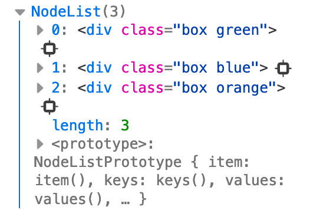
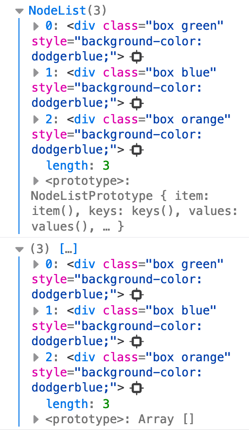
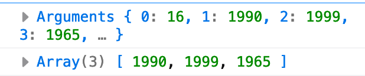
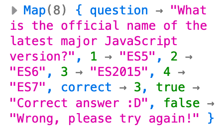

# ES-6

## LET AND CONST

**ES5** function scope 
```js
var name5 = 'sofia mejia';
var age5 = 23;
name5 = 'sofia muro';
console.log(name5); // sofia muro
```

**ES6** block scope

const are immutable
```js
const name6 = 'sofia mejia';
let age6 = 23;
name6 = 'sofia muro';
console.log(name6); // error 
```

## FUNCTIONS

**ES5**
```js 
function driversLicence5(passedTest) {
  console.log(firstName) // undefined
  if (passedTest) {
    var firstName = 'John';
    var yearOfBirth = 1990;
  }
  // It is possible to read the varibles outside the if but not ourside the function
  console.log(firstName + ', born in ' + yearOfBirth + ', is now officially allowed to drive a car.');
}
console.log(firstName + ', born in ' + yearOfBirth + ', is now officially allowed to drive a car.');  // error
// var is function scope so console.log does not work here

driversLicence5(true);
```

**ES&**
```js
function driversLicence6(passedTest) {
  console.log(firstName); // does not work unlike es5 var that return a undefined
  // As let and const are block scope if we want to use them out of the block scope we need to declare them and defined( in the case of const) outside the scope
  let firstName;
  const yearOfBirth = 1990;

  if (passedTest) {
    firstName = 'jonh'

    // These let and const as they are declared aand defined inside they can not be used outside the scope
    let firstNameInside;
    const yearOfBirthInside = 1990;
    console.log(firstNameInside + ', born in ' + yearOfBirthInside + ', is now officially allowed to drive a car.');
  }
  
  // firstNameInside && yearOfBirthInside  does not work because block scope
  console.log(firstNameInside + ', born in ' + yearOfBirthInside + ', is now officially allowed to drive a car.');

  // This work because the variables were declaare and define outisde
  console.log(firstName + ', born in ' + yearOfBirth + ', is now officially allowed to drive a car.');
}

//  Would not work here neither inside function or inside block
cosole.log()

driversLicence6(true);
```

In ES5 a varible called before its declaration gave back 'undefined' but in ES6 it is not even possible to use them. 

>> Uncaugh error : x is not defined

The variables are hoisted as well as in es5 but it it not possible to access to them

```js
let i = 23;

for (let i = 0; i < 5; i++) {
  // this work here due to block scope and 'i' is differetnt to 'i' outside
    console.log(i); 
    // 1
    // 2
    // 3
    // 4
    // 5 
}

let i = 24  
console.log(i) // error of redeclartion
```

```js
var i = 23;

for (var i = 0; i < 5; i++) {
    console.log(i);
}

// As var is function scope here 'i' receive a new value
console.log(i);
// 0 
// 1 
// 2 
// 3 
// 4 
// 5
```

## BLOCKS AND IIFIS

In **ES6** they way to create data privacy is uising blocks of code, as in es5 iifis

```js
This is a block
{} 

{
  const a = 1;
  let b =2;
  var c = 3;
}
```
**ES5** iifes
```js
(function () {
  var a = 1;
  var b =2;
  var c = 5;
})();

// This values are not acceced from the outside as in a iife, neither ES6 or ES5
console.log(a + b);

// This works on ES6 because var is not block scope
console.log(c); // 3
```


## STRINGS
```js
let firstName = 'John';
let lastName = 'Smith';
const yearOfBirth = 1990;

function calcAge(year) {
  return 2020 - year;
}
```

**ES5**
```js
console.log('This is ' + firstName + ' ' + lastName + '. He was born in ' + yearOfBirth + '. Today, he is ' + calcAge(yearOfBirth) + ' years old.');
```

**Template literals** `` --> we want to use a tempalte literal  ${} --> inside variables, call functions
**ES6**
```js
console.log(`This is ${firstName} ${lastName}. He was born in ${yearOfBirth}. Today, he is ${calcAge(yearOfBirth)} years old.`);
```

New string methods
```js
const n = `${firstName} ${lastName}`;
```
This three methods return a boolean, it is case sesitive
```js
console.log(n.startsWith('j')); // false
console.log(n.startsWith('J')); // true
console.log(n.endsWith('Sm'));  // true
console.log(n.includes('oh'));  // true

console.log(`${firstName} `.repeat(3)); // John John John
console.log(firstName.repeat(3)); // JohnJohnJohn
```

## Arrow functions
```js
const years = [1990, 1965, 1982, 1992];
```
**ES5**
```js
//  map method returns a new array , map(current, index, array)
var ages5 = years.map(function(el) {
  return 2020 - el;
});
console.log(ages5); // [30, 55, 38, 28]
```

**ES6**
```js
// With one argument and one line --> no curly brances and implict return
let ages6 = years.map(el => 2020 - el);
console.log(ages6);

// More than one arguement and one line --> parenthesis for arguments, no curly braces and implicit return 
ages6 = years.map((el, index) => `Age element ${index + 1}: ${2020 - el} yo.`);
console.log(ages6);

// More than one line in the return --> curly braces and explicit return 
ages6 = years.map((el, index) => {
  const now = new Date().getFullYear();
  const age = now - el;
  return `Age element ${index + 1}: ${age}.`
});
```

**ES5**

```js
var box5 = {
  color: 'green',
  position: 1,
  clickMe: function() {
  // the following console.log refers to the object where the method clickMe was created, that is box5
   console.log(this); 
   //clickMe: function clickMe()
   //color: "green"
   //position: 1

    // Create a new variable to storing 'this' refering to the box5 obejct and be able to use it inside the function callback
    var self = this;  
    //Now this stores the object and can be accessed inside the callback funtion
    console.log(self); // Object { color: "green", position: 1, clickMe: clickMe() }

    document.querySelector('.green').addEventListener('click', function() {
      // This str wont work becausee the callback function creates a new scope so 'this' referes to the global object
      // var str = 'This is box number ' + this.position + ' and it is ' + this.color;
      // Now it works!
      var str = 'This is box number ' + self.position + ' and it is ' + self.color;
      alert(str);
    });
  }
}
box5.clickMe();
```

**ES6**
```js
const box6 = {
  color: 'green',
  position: 1,
  clickMe: function() {
    // We are usign an arrow function '() => {}' instead of a 'function(){}' , both work as a callback function
    // Changing to arrow function share 'this' with their surroundings
    document.querySelector('.green').addEventListener('click', () => {
        var str = 'This is box number ' + this.position + ' and it is ' + this.color;
        alert(str);
    });
  }
  /*
  If we change the method to a arrow function, when using this we will refer to the window object, beacause arrow functions 'share' 
  the 'this' with theyr surroundings, that's why it is kept it as a ES5 function
  clickMe: () => {
    console.log(this); // window object
    console.log(this.box5); // remeber why you can only retireve box5 
  }
  */
}
box6.clickMe();
```


```js
var Person = function(name) {
  this.name = name;
}
```
**ES5**
```js
Person.prototype.myFriends5 = function(friends) {
  var arr = friends.map(function(el) {
     return this.name + ' is friends with ' + el; 
  });
  // console.log(arr); // " is friends with Mark" 
  // Can not access to this.name for the same reasons mentioned above, we are creating a new scope with the map function.
  
  // In order to fix this we can use the bind method, we are passing as an argument 'this' and create a copy
  var arr = friends.map(function(el) {
     return this.name + ' is friends with ' + el; 
  }.bind(this));
}

var friends = ['Bob', 'Jane', 'Mark'];
new Person('John').myFriends5(friends);
```
**ES6**
```js
Person.prototype.myFriends6 = function(friends) {
  // There is no need of bind method because arrow functions allow the use the superior this
  let arr = friends.map(el => `${this.name} is friends with ${el}`);
  console.log(arr); // "Mike is friends with Bob"
}
new Person('Mike').myFriends6(friends);
```

## Destructuring

Extract data from an object or an array

### ARRAYS

**ES5**
```js
var john = ['John', 26];
```
Store each element in a single variable, what would happen if we needed to store a lot of elements, say 10.
```js
var name = john[0];
var age = john[1];
```
**ES6**
```js
const [name, age] = ['John', 26];
console.log(name);
console.log(age);
```

### OBJECTS
**ES6**
```js
const obj = {
  firstName: 'John',
  lastName: 'Smith'
};

// Names must be the same
const {firstName, lastName} = obj;
console.log(firstName);
console.log(lastName);

// If we don't want the name to match with the keys of the object
const {firstName: a, lastName: b} = obj;
console.log(a);
console.log(b);
```
Return multiple values from a function using destructuring

```js
function calcAgeRetirement(year) {
  const age = new Date().getFullYear() - year;
  return [age, 65 - age];
}

const [age2, retirement] = calcAgeRetirement(1990);
console.log(age2);
console.log(retirement);
```

## Arrays in ES6

Remember that when use **querySelectorAll()** method it returns a list of node elements

So we need to transform this list into an array in order to apply to them array methods.

```js
const boxes = document.querySelectorAll('.box');
console.log(boxes);
```




**ES5**
```js
 var boxesArr5 = Array.prototype.slice.call(boxes);
 console.log(boxesArr5);
 ```



```js
boxesArr5.forEach(function(cur) {
    cur.style.backgroundColor = 'dodgerblue';
});
```
**ES6**

In ES6 we use the method Array.from(the thing we want to tranform into an array)

```js
const boxesArr6 = Array.from(boxes);
boxesArr6.forEach(cur => cur.style.backgroundColor = 'dodgerblue');
console.log(boxesArr6);  
```

## LOOPS

**ES5**

```js
for(var i = 0; i < boxesArr5.length; i++) {  
  if(boxesArr5[i].className === 'box blue') {
      continue;
  }
  // remember break and continue
  boxesArr5[i].textContent = 'I changed to blue!';    
}
```

**ES6**

In ES6 new loop **'for of'**, less code is written

method includes() returns boolean

```js
for (const box of boxesArr6) {
  if (box.className.includes('blue')) {
      continue;
  }
  box.textContent = 'I changed to blue in ES6!';
}
```

### New array methods

**ES5**
```js
var ages = [12, 17, 8, 21, 14, 11];
var full = ages.map(function(cur) {
    return cur >= 18;
});

console.log(full); // [ false, false, false, true, false, false ]
console.log(full.indexOf(true)); // 3
console.log(ages[full.indexOf(true)]); // 21
```

**ES6** 

findIndex() method accepts a callback function returning true, the arguments can be the three as in map ()

```js
// ES5 console.log(full.indexOf(true)); // 3
console.log(ages.findIndex(cur => cur >= 18)); // 3
// ES5 console.log(ages[full.indexOf(true)]); // 21
console.log(ages.find(cur => cur >= 18)); // 21

// Both methods work as well with strings
var strArr = ['hola', 'mundo'];
console.log(strArr.findIndex(cur => cur === 'mundo')); // 1
console.log(strArr.find(cur => cur === 'mundo')); // mundo
```

## NEW OPERATOR IN JS SPREAD/dispersar to expand elements 

```js
function addFourAges (a, b, c, d) {
    return a + b + c + d;
}

var sum1 = addFourAges(18, 30, 12, 21);
console.log(sum1); // 81
```

**ES5**
If instead of passig one by one the ages and we have it in an array , how can we pass the ages as an argument?
```js
var ages = [18, 30, 12, 21];
```

Appl() method use the element of the array as the function arguments
```js
// null as replacing 'this'
var sum2 = addFourAges.apply(null, ages);
console.log(sum2); // 81
```

**ES6**

... take the things out the array into each individual element , so there is no neeed of apply()
```js
const sum3 = addFourAges(...ages);
console.log(...ages);  // 18 30 12 21
console.log(sum3); // 81
```

... spread operator can also be used to join arrays
```js
const familySmith = ['John', 'Jane', 'Mark'];
const familyMiller = ['Mary', 'Bob', 'Ann'];
const bigFamily = [...familySmith, 'Lily', ...familyMiller];
console.log(bigFamily); // ['John', 'Jane', 'Mark', 'Lyli','Mary', 'Bob', 'Ann']
```

 ... spread operator can be used not only on arrays also in node lists
 ```js
const h = document.querySelector('h1');
const boxes = document.querySelectorAll('.box');
console.log(h); // <h1>
console.log(boxes); // node list
const all = [h, ...boxes]; // an array!

console.log(all);

all.forEach(cur => cur.style.background = 'pink');
// As it is already an array we don not need to change it 
Array.from(all).forEach(cur => cur.style.color = 'purple');
```

## FUNCTION PARAMETERS 
### **REST PARAMETERS** : allow us to pass an arbitrary number of parameters into a function, and use them into the function

 ... same notation, the oposite of spread operator, 

**spread operator**: we use it a funtion call as a parameter 
**rest prameter**: is used in a function declaration to accept an arbitray number of parameters


**ES5**
```js
function isFullAge5() {
    // arguments is a special word to see the arguments passed to a function
    // arguments it is not an array so if we need to use it as in array we need to change it to an array
    console.log(arguments); // 2010, 1999, 1965
    
    var argsArr = Array.prototype.slice.call(arguments);
    
    argsArr.forEach(function(cur) {
        console.log((2020 - cur) >= 18);
    }) 
}


isFullAge5(2010, 1999, 1965);
isFullAge5(1990, 1999, 1965, 2016, 1987); 
```


**ES6**

As soon as we call the function it will take tha parameters and tranform them into a array
```js
function isFullAge6(...years) {
    console.log(years); // [ 1990, 1999, 1965, 2016, 1987 ]
    years.forEach(cur => console.log( (2020 - cur) >= 18));
    
}

isFullAge6(1990, 1999, 1965, 2016, 1987);
```


Adding an extra parameter, that it two parameters for two different situations
**ES5**
```js
function isFullAge5(limit) {
    console.log(arguments);
    // slice() cut a piece of an array , (arguments, 1) exclude de 1º agumente, that is limit
    var argsArr = Array.prototype.slice.call(arguments, 1);
    console.log(argsArr);
    argsArr.forEach(function(cur) {
        console.log((2020 - cur) >= limit);
    })
}

isFullAge5(16, 1990, 1999, 1965);
```


**ES6**
```js
function isFullAge6(limit,...years) {
    console.log(limit); // 16
    console.log(years); // [1990, 1999, 1965, 2016, 1987]
    years.forEach(cur => console.log( (2016 - cur) >= limit));
}

isFullAge6(16, 1990, 1999, 1965, 2016, 1987);
```


### **Default parameters** when we want to preset the value of a parameter

**ES5**

Values are specified inside the object constructor
```js
function SmithPerson(firstName, yearOfBirth, lastName, nationality) {
    
    lastName === undefined ? lastName = 'Smith' : lastName = lastName;
    nationality === undefined ? nationality = 'american' : nationality = nationality; 
    
    this.firstName = firstName;
    this.lastName = lastName;
    this.yearOfBirth = yearOfBirth;
    this.nationality = nationality;

}

var john = new SmithPerson('John', 1990);
// we are only specifying 2 values of the object, so when we console the jonh object the resutl will be that the not defined values will be 'undefined'
console.log(john); 

var emily = new SmithPerson('Emily', 1983, 'Diaz', 'spanish');
console.log(emily);
```

**ES6**

Values are specified and passed in the parameters
```js
function SmithPerson(firstName, yearOfBirth, lastName = 'Smith', nationality = 'american') {
    this.firstName = firstName;
    this.lastName = lastName;
    this.yearOfBirth = yearOfBirth;
    this.nationality = nationality;
}

var mark = new SmithPerson('Mark', 1990);
console.log(mark);
```


## MAPS

Maps is a data structure, new key value data structure, new built in type 

Maps create hash map

```js
const question = new Map();
```

Defining a key-value pair
```js
question.set('question', 'What is the official name of the latest major JavaScript version?');
question.set(1, 'ES5');
question.set(2, 'ES6');
question.set(3, 'ES2015');
question.set(4, 'ES7');
question.set('correct', 3);
question.set(true, 'Correct answer :D');
question.set(false, 'Wrong, please try again!');

console.log(question);
```


```js

console.log(question.get('question')); // What is the official name of the latest major JavaScript version?
console.log(question.size); // 8

// To delete a element, we pass the key
question.delete(4); 
// We look on map to have the '4' key
question.has(4)

// Delete all the elements of the map
question.clear();
if(question.has(4)) {
  console.log('Answer 4 is here')
}

if(question.has(2)) {
    console.log('Answer 2 is here')
} 

```
Unlike objects, maps are iterable

as **forEach(cuerrent, index, array)** in a array

```js
// forEach(cuerrent value , current key, the map) in a map
question.forEach((value, key) => console.log(`This is ${key}, and it's set to ${value}`));
```

we can uso **for of** as in arrays
```js
for (let key of question) {
  // returns an array where key is 0 an value is 1
  console.log(key); // Array [ "correct", 3 ]
} 
 
 // entries() return entries of map
for (let key of question.entries()) {
  // returns an array where key is 0 an value is 1 as above
  console.log(key); // Array [ "correct", 3 ]
}

for (let [key] of question.entries()) {
  console.log(key); // correct
}

for (let [key, value] of question.entries()) {
  // key and value separtely
  console.log(key, value); // correct 3
}

 for (let [key, value] of question.entries()) {
    if (typeof(key) === 'number') {
        console.log(`Answer ${key}: ${value}`);
    }
 } 

 
const ans = parseInt(prompt('Write the correct answer'));
console.log(question.get(ans === question.get('correct')));
```

We can use anythings as key unlike objects that is only strings and integers

Maps are iterable

Easily to add or remove data

## CLASSES

Make it easier to implement iheritance

**In ES5 function contructores**

**ES5**
```js
var Person5 = function(name, yearOfBirth, job) {
    this.name = name;
    this.yearOfBirth = yearOfBirth;
    this.job = job;
}

Person5.prototype.calculateAge = function() {
    var age = new Date().getFullYear() - this.yearOfBirth
    console.log(age);
}

var john5 = new Person5('John', 1990, 'teacher');

john5.calculateAge();
```

**ES6**

All classes have to have a contructuor method
```js
class Person6 {

    constructor (name, yearOfBirth, job) {
        this.name = name;
        this.yearOfBirth = yearOfBirth;
        this.job = job;
    }
    
    calculateAge() {
        var age = new Date().getFullYear() - this.yearOfBirth;
        console.log(age);
    }
    // static methods are attached to the class but are not inherited to the instances
    static greeting() {
        console.log('Hey there!');
    }

}

// Creating an instance of the class
const john6 = new Person6('John', 1990, 'teacher');

Person6.greeting();
// we can not using it in john so john6.greeting() won't work
```

Classes are not hoisted as function contructures are. 

We can only add methods to classes but not properties

## Classes with subclasses

Implement inheritance between classes

**ES5**

Superclass
```js
var Person5 = function(name, yearOfBirth, job) {
  this.name = name;
  this.yearOfBirth = yearOfBirth;
  this.job = job;
}
 
Person5.prototype.calculateAge = function() {
  var age = new Date().getFullYear() - this.yearOfBirth;
  console.log(age);
}
```
Subclasss

Pass the parameters it will inherit + the ones of the subclass
```js
var Athlete5 = function(name, yearOfBirth, job, olymicGames, medals) {
  Person5.call(this, name, yearOfBirth, job);
  this.olymicGames = olymicGames;
  this.medals = medals;
}

Athlete5.prototype = Object.create(Person5.prototype);

Athlete5.prototype.wonMedal = function() {
    this.medals++;
    console.log(this.medals);
}

var johnAthlete5 = new Athlete5('John', 1990, 'swimmer', 3, 10);

johnAthlete5.calculateAge();
johnAthlete5.wonMedal();
```

**ES6**
```js
class Person6 {
  constructor (name, yearOfBirth, job) {
    this.name = name;
    this.yearOfBirth = yearOfBirth;
    this.job = job;
  }

  calculateAge() {
    var age = new Date().getFullYear() - this.yearOfBirth;
    console.log(age);
  }
}
```
```js
// A se  extiende de B
class Athlete6 extends Person6 {
  constructor(name, yearOfBirth, job, olympicGames, medals) {
    // super set this somehow
    super(name, yearOfBirth, job);
    this.olympicGames = olympicGames;
    this.medals = medals;
  }
  
  wonMedal() {
    this.medals++;
    console.log(this.medals);
  }
}

const johnAthlete6 = new Athlete6('John', 1990, 'swimmer', 3, 10);

johnAthlete6.wonMedal(); // 11
johnAthlete6.wonMedal(); // 12 
johnAthlete6.wonMedal(); // 13
johnAthlete6.wonMedal(); // 14
johnAthlete6.calculateAge(); // 30
```

