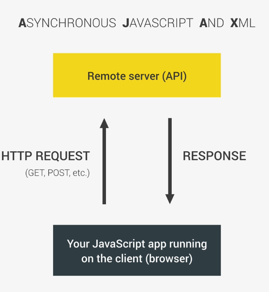
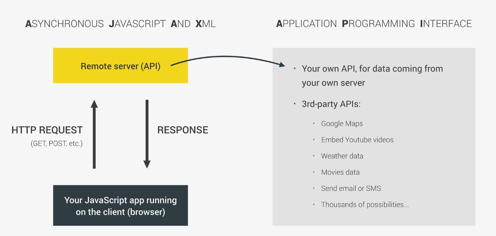

# Asynchronous JS

Synchronous first, all the instructions are executed one after the other, line by line as they appear in the code
```js
const second = () => {
  console.log('second');
}
const first = () => {
  console.log('Hey there, first!');
  second()
  console.log('the end');
}
```

Async: code that should be executed later

```js
const second = () => {
  setTimeout(() =>{
    console.log('Async,  hey there');
  }, 2000);
};

const first = () => {
  console.log('Hey there, first!');
  second()
  console.log('the end');
};

first()
```

What I expected:
```js
// hey there!
(after two seconds) // async hey there!
//the end
```

What happened is that Async,do not stop the code, in this case, two seconds, do not wait until the other function to finish to start the next one

That is, it is non blocking


## The Event Loop


We can use callback funtions differ actions into the future

wait on the message queue 

Event loop is constatly monitoring the message queue and execution stack and push the callback functions
 


## ASYNC The old way (CALLBACKS) callback helll

```js
 function getRecipe() {
  // setTimeout() simulates the server
  setTimeout(() => {
    // we get a bunch of id recipies
    const recipeID = [523, 883, 432, 974];
    console.log(recipeID);
    setTimeout(id => {
      // we choose a id an ask for that recipe
      const recipe = {title: 'Fresh tomato pasta', publisher: 'Jonas'};
      console.log(`${id}: ${recipe.title}`);
      setTimeout((publisher,id )=> {
        const recipe2 = {title: 'Italian Pizza', publisher: 'Jonas'};
        console.log(`${id}: ${recipe2.title}`);
      }, 1000, recipe.publisher, recipeID[0]);   
    }, 1000, recipeID[2]); 
  }, 1500);
}
getRecipe();
```

## ASYNC using ES6 (PROMISES)

ES6 feature


**Promises state**


We can produce or  consume a promise

Te callback function inside the new promise is called **EXECUTER**, The executer fuction informs the promise wheather the event was succesful or not, the executer is immediatly call once the promise is executed.

**Executer** callback function takes as parameters two callback functions.

If the event is succesful we call the **resolve** funciton otherway we call **reject**  

**PRODUCE**
```js
const getIDs = new Promise((resolve, reject) => {
  setTimeout(() => {
    // Calling the resolve function will mark the promise as fulfilled
    // Resolve take one argument and is the result of the promise , the data
    resolve([523, 883, 432, 974]);
  }, 1500);
});
```
**CONSUME**

There are two methods in all promises objects **then** and **chatch**

**.then( )** when the promise is fullfilled, that is, resolved. The argument of this method will be the result of the succesful promise.
```js
getIDs
// IDs == data
.then(IDs => {
  console.log('then',IDs); // [523, 883, 432, 974]
})
```
**.catch( )**  allows us to have a handler in case our promise is rejected. Commonly we pass as an argument 'error'.
```js
.catch(error =>{
  console.log('error!',error); // error
})
```


Complete example
The difference between getIDs and recID is that for the first one it is defined the promise directly to de variable because it no need paramenters, and as getRecipe do need the promise is the return of the function
```js
const getIDs = new Promise((resolve, reject) => {
  setTimeout(() => {
    resolve([523, 883, 432, 974]);
  }, 1500);
});
```
```js
const getRecipe = recID => {
  return new Promise((resolve, reject) => {
    setTimeout(ID => {
      const recipe = {title: 'Fresh tomato pasta', publisher: 'Jonas'};
        resolve(`${ID}: ${recipe.title},${recipe.publisher}`);
      }, 1500, recID);
  })
};
```
```js
const getRelated = publisher => {
  return new Promise ((resolve, reject) => {
    setTimeout(pub => {
      const recipe = {title: 'pizza', publisher: 'Jonas'};
        resolve(`${recipe.title},${recipe.publisher}`);
    }, 1000, publisher)
  })
}
```
**Chaining**
```js
getIDs
.then(IDs => {
  console.log('then',IDs);
  // this   getRecipe(IDs[2])  will return a promise, that if resolve gives us the id and the recipe name
  return getRecipe(IDs[2]) 
})
.then(recipe => {
  console.log('recipe',recipe);
  return getRelated(recipe.publisher)
})
.then(recipe => {
  console.log(recipe);
})
.catch(error => {
  console.log('error!',error);
});
```

IN ES8 2017 **async/await** was introduced, design to consume promises not to produce them

Consume a promise using **async/await**

1º Create a async function, means that the function is an asyn funtion, keeps running in the background
```js
async function getRecipesAW() {
// Inside we can have one or more await expressions, await only can exist inside async function
// await the result of the promise
  const IDs = await getIDs;
  console.log(IDs);
  const recipe = await getRecipe(IDs[2]);
  console.log(recipe);
  const related = await getRelated('Jonas');
  console.log(related);

  return recipe
}

  // getRecipesAW();
  // Consume a promsise, beacuse a apromise is returned
  getRecipesAW().then(result => console.log(`${result} is the best ever!`));
```

## AJAX and APIS

Asynchronous Javascript and Xml





